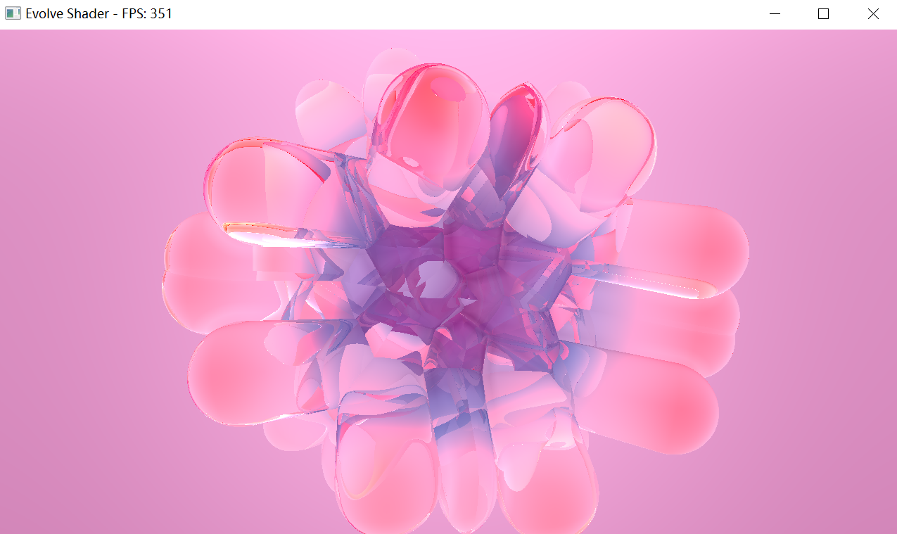
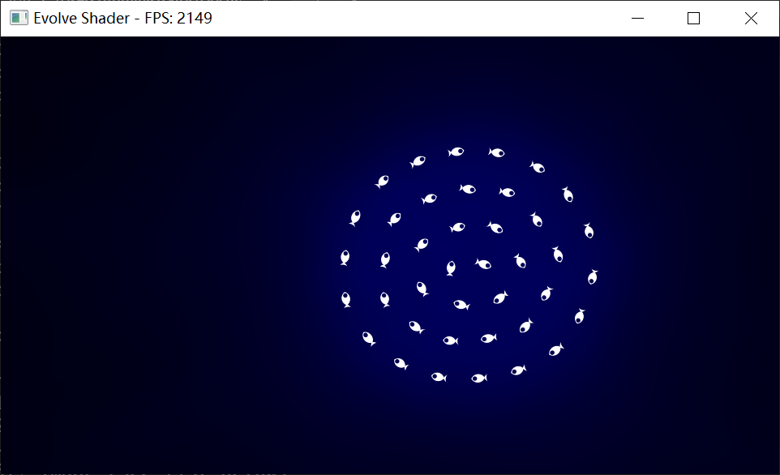

# Evolve Shader

[English README](readme.md)

Evolve Shader 是一个受 Shadertoy 启发的轻量级多通道 Shader 预览器。
它会从 `frag/` 加载片元着色器，交互式配置 `iChannel0`-`iChannel3`，将每个 pass 渲染到 ping-pong 帧缓冲中，最后把最后一个 pass 显示到窗口上。

## 截图




## 当前仓库的实际结构

```text
Evolve-Shader/
├─ main.cpp
├─ include/
│  ├─ ChannelConfig.h
│  ├─ GLTypes.h
│  ├─ Resources.h
│  ├─ ShaderIO.h
│  └─ ShaderProgram.h
├─ frag/
│  ├─ 1.frag
│  └─ 2.frag
├─ iChannel/
│  ├─ bw_noise.png
│  ├─ color_noise.png
│  ├─ london.png
│  └─ rock.png
├─ Evolve shader.sln
├─ Evolve shader.vcxproj
├─ LICENSE
└─ readme.md
```

## 功能概览

- 使用 Shadertoy 风格入口：`mainImage(out vec4 fragColor, in vec2 fragCoord)`。
- 根据 `frag/` 目录中 `.frag` 文件名里的数字顺序执行多通道渲染。
- 交互式配置 `iChannel`，可选择 `none`、`self`、其他 buffer、或 `iChannel/` 里的图片。
- 支持 ping-pong FBO，实现 feedback / temporal 效果。
- 支持常见 Shadertoy uniform：`iResolution`、`iTime`、`iMouse`、`iDate`、`iChannelResolution` 等。
- 对 `iChannel/` 下的图片做全局纹理缓存。
- 在窗口标题栏显示 FPS。

## 程序启动时会做什么

程序启动后会按下面流程运行：

1. 递归扫描 `iChannel/` 中的 `.png`、`.jpg`、`.jpeg` 图片。
2. 非递归扫描 `frag/` 中的 `.frag` 文件。
3. 按文件名中出现的第一个数字为 shader pass 排序。
4. 提示你为每个 pass 配置 `iChannel0`-`iChannel3`。
5. 先离屏渲染所有 pass，再把最后一个 pass 显示到屏幕上。

几个容易忽略的细节：

- `frag/` 中如果文件名不带数字，这个文件会被忽略。
- `frag/` 当前不是递归扫描。
- `iChannel/` 当前是递归扫描。
- 第一帧读取 buffer 时，会退回到一个空纹理。
- 已配置到 channel 的全局图片会在进入主循环前预加载。
- 默认开启垂直同步；可用 `EVOLVE_SHADER_VSYNC=0` 关闭。

## Shader Pass 命名建议

渲染顺序由文件名中的第一个数字决定。

推荐命名：

```text
0_main.frag
1_blur.frag
2_feedback.frag
3_present.frag
```

当前仓库里的示例是：

```text
frag/1.frag
frag/2.frag
```

## 支持的 Uniform

`include/ShaderIO.h` 会自动把你的 shader 包装成可执行的 Shadertoy 风格片元着色器，并暴露以下 uniform：

| Uniform | 类型 | 说明 |
| --- | --- | --- |
| `iResolution` | `vec3` | 当前帧缓冲分辨率，代码里目前固定 `z = 1.0`。 |
| `iTime` | `float` | 启动后的秒数。 |
| `iTimeDelta` | `float` | 当前帧与上一帧的时间差。 |
| `iFrame` | `int` | 帧计数。 |
| `iFrameRate` | `float` | 由 `iTimeDelta` 计算出的帧率。 |
| `iDate` | `vec4` | 年、月、日、当天经过的秒数。 |
| `iMouse` | `vec4` | Shadertoy 风格鼠标状态。 |
| `iChannel0`-`iChannel3` | `sampler2D` | 纹理或 buffer 输入。 |
| `iChannelTime[4]` | `float[4]` | 当前实现里四个值都等于 `iTime`。 |
| `iChannelResolution[4]` | `vec3[4]` | 每个 channel 当前绑定纹理的分辨率。 |
| `iSampleRate` | `float` | 当前固定为 `44100.0`。 |

`iMouse` 的语义与 Shadertoy 接近：

- `xy`：当前鼠标位置，坐标原点在左下角。
- `zw`：按住左键时是当前按下位置；松开后变成最近一次点击位置的负值。

## 依赖项

这个仓库没有把所有第三方依赖都直接放进来。
当前 Visual Studio 工程默认依赖你的本地环境已经提供：

- 支持 OpenGL 3.3 的显卡与驱动
- `glfw3`
- `glad`
- `stb_image.h`

项目文件当前使用的是 MSVC 工具集 `v145`。
如果你的 Visual Studio 没有对应工具集，IDE 可能会提示你重定向或升级工具集。

## 推荐的 Windows 构建方式

推荐使用 Visual Studio + vcpkg。

### 1）安装 vcpkg

```powershell
git clone https://github.com/microsoft/vcpkg
cd vcpkg
.\bootstrap-vcpkg.bat
.\vcpkg integrate install
```

### 2）安装依赖

```powershell
.\vcpkg install glfw3 glad stb --triplet x64-windows
```

### 3）打开并编译

- 用 Visual Studio 打开 `Evolve shader.sln`
- 选择 `x64` 平台，以及 `Debug` 或 `Release`
- 直接构建解决方案

### 4）注意工作目录

程序运行时会按相对路径查找 `frag/` 和可选的 `iChannel/`。

所以运行时的工作目录应当是仓库根目录，而不是 `x64/Release/` 之类的输出目录。

## 使用方法

### 快速开始

1. 把一个或多个 `.frag` 文件放到 `frag/`
2. 可选：把图片放到 `iChannel/`
3. 启动程序
4. 第一轮提示时按 `Enter` 使用自动串联，或输入某个 pass 的编号手动配置 channel

### 自动串联模式

如果第一步直接按 `Enter`，程序会自动创建一个简单链路：

- 第 2 个 pass 的 `iChannel0` 读取第 1 个 pass
- 第 3 个 pass 的 `iChannel0` 读取第 2 个 pass
- 依此类推

### 手动配置模式

对某个指定 pass，你可以把每个 channel 设为：

- `none`
- `self`，即自反馈
- 其他 buffer
- `iChannel/` 下扫描到的全局图片

## Shader 示例

```glsl
void mainImage(out vec4 fragColor, in vec2 fragCoord)
{
    vec2 uv = fragCoord / iResolution.xy;
    fragColor = vec4(uv, 0.5 + 0.5 * sin(iTime), 1.0);
}
```

你不需要自己写 `main()`。
运行时会自动包装你的 shader。

## 当前限制与说明

- 代码结构本身具备跨平台潜力，但当前仓库只提供了 Visual Studio 工程。
- `iChannel` 配置只在运行时交互输入，不会保存到磁盘。
- Shader 只在启动时加载一次，目前没有热重载。
- 屏幕上最终显示的永远是最后一个 pass。
- `iChannel` 配置仍然是运行时交互输入，但已配置的图片会在进入渲染循环前预加载。
- `frag/` 里的示例 shader 自带上游署名注释，请保留它们原本的授权说明。

## 许可证

项目本身使用 MIT 许可证，见 `LICENSE`。

第三方 shader、图片资源可能带有独立授权或署名要求，使用前请分别确认。
